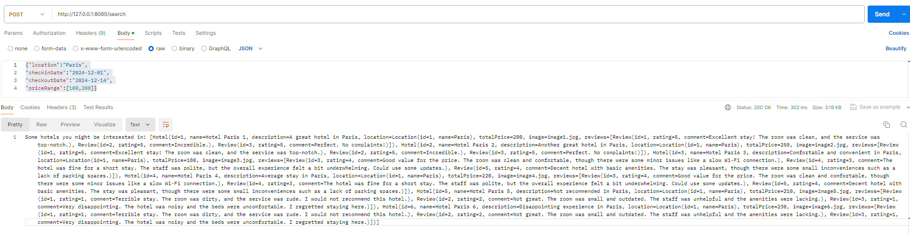

# Project Name
Hotel Search API

## Table of Contents

- [Prerequisites](#prerequisites)
- [Building the Project](#building-and-running-the-project)
- [Project Structure](#project-structure)
- [Testing](#testing)

## Prerequisites 

IntelliJ IDE installed, with gradle plugin, and Amazon Corretto 11. Postman desktop version.

## Building and running the project
Open the project using IntelliJ and automatic build should trigger. Assure that your project settings
are correct, opening Project Structure -> Project, and assuring that the SDK is set to Amazon Corretto
11.0.24 or another compatible version.

Navigate to src/main/kotlin/com.expedia/Applicaton.kt and click the play button to the left of Application
and select 'Run ApplicationKt.main()'. The project will start and when it's ready, you should see:

Responding at http://127.0.0.1:8080 in the terminal. 

Once the project is started, a search request can be made to the server using postman desktop version with the following
params:

POST -> http://127.0.0.1:8080/search
BODY -> Select raw, JSON and submit request:

{"location":"Paris",   
"checkinDate":"2024-12-01",   
"checkoutDate":"2024-12-14",   
"priceRange":[100,200]}   

Results:

## Project structure
For the purpose of this assessment, a mock data source is used for Hotel Data. The project is organized to
have an interface that will define the contracts for any services that perform searches. Search and business
logic is contained in domain/Hotel Search Service, and the models package contains the relevant data models
for the search service, as well as the data models for requests and responses to and from the service. 

The project uses the KTOR framework to create the API server, and the routes are contained in routes folder.

Currently, this project takes a user search input and filters hotels by the input location, returning a list
of hotels in the search location, ordered by average review (starting with the highest reviews).

src/  
└── main/  
└── kotlin/  
└── com/expedia/  
├── domain/  
│   ├── HotelSearchService.kt  
│   └── MockHotelDataSource.kt  
├── interfaces/  
│   └── HotelSearchInterface.kt  
├── models/  
│   ├── Hotel.kt  
│   ├── HotelSearchRequest.kt  
│   ├── HotelSearchResponse.kt  
│   └── Location.kt  
│   └── Review.kt  
├── plugins/  
│   ├── Routing.kt  
│   └── Serialization.kt  
├── routes/  
│   ├── HotelSearchRoutes.kt  
│   └── Application.kt  

## Testing
